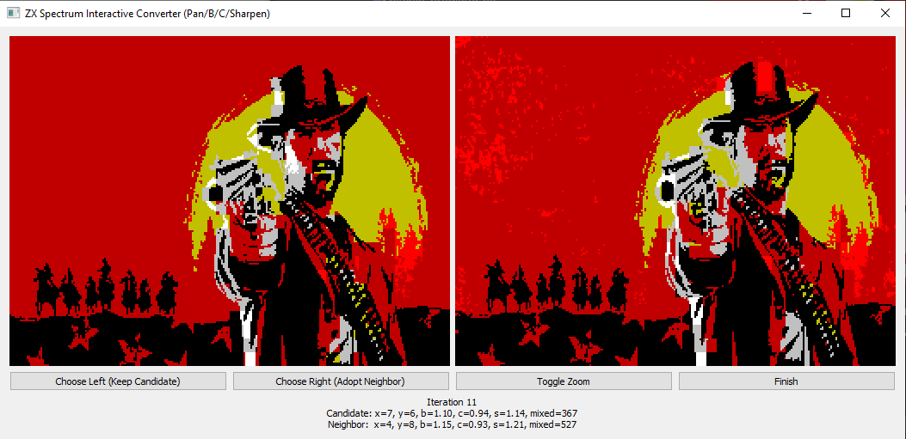

# ZX Spectrum Interactive Converter



**Convert your images into retro-style ZX Spectrum graphics** with an _infinite hill-climb_ approach. The program dynamically adjusts:
- **Pan** (x & y offsets)
- **Brightness** (applied before quantization)
- **Contrast** (applied before quantization)
- **Sharpen** (applied before quantization)

In each iteration, you pick which version of the image looks best; the app spawns **two background threads** to pre-compute your next possible neighbors. No more waiting for each new preview to appear!

## Features

- **Fully Interactive**: No command-line, no automations—just a sweet GUI that allows you to pick the best candidate by eye.
- **Infinite Hill-Climb**: Continue refining the image as long as you want. There’s no artificial 10-step or 20-step limit.
- **Real-Time Threads**: While you’re choosing between the current candidate and its neighbor, it’s already computing the next set of neighbors in the background.
- **ZX Spectrum–Style Quantization**: 15-color palette, with 8×8 attribute blocks.  
- **Pan, Brightness, Contrast, and Sharpen** are all adjusted **before** the color quantization—ensuring your changes have a real effect on how the final image looks.

## Quick Start

1. **Clone or download** this repository:
    ```bash
    git clone https://github.com/xanax/zx-graphics-converter.git
    cd zx-graphics-converter
    ```
2. **Install dependencies** (Python 3.7+ recommended):
    ```bash
    pip install pillow numpy PyQt5
    ```
3. **Run the script** with:
    ```bash
    python zx_interactive.py input.jpg output.png
    ```
   - `input.jpg` can be any image file you like.
   - `output.png` is where the final retro image will be saved when you click **Finish**.

4. **Play with the GUI**:
   - The program shows two images: **Candidate** (left) and **Neighbor** (right).
   - **Choose Left** if you’d like to stick with the Candidate, or **Choose Right** to adopt the Neighbor.
   - Behind the scenes, new neighbors are being generated in real time, so the display updates swiftly.
   - You can toggle double-size or normal-size with **Toggle Zoom**.
   - When you are satisfied with the look of the Candidate, click **Finish** to save your masterpiece.

## Project Structure

```
zx-spectrum-interactive/
  ├─ zx_interactive.py         # Main Python script with the interactive GUI
  ├─ README.md                 # This file

```

- **`zx_interactive.py`**: The entire interactive logic, including:
  - Randomized neighbor generation for (x, y, brightness, contrast, sharpen).
  - A background-thread approach to pre-computing neighbors.
  - ZX palette quantization logic.

## How It Works Under The Hood

1. **Resize & Enhance**  
   The input is resized to `(256+8)×(192+8)` and then we apply brightness, contrast, and sharpen transformations.  

2. **Pan & Crop**  
   The image is cropped to `(256×192)` using the current `x`/`y` offsets.

3. **ZX Palette Conversion**  
   Each 8×8 block is matched against the 15-color ZX palette. Blocks can either use **one** or **two** colors, minimizing the error.

4. **Hill-Climb**  
   - Each iteration, you see two images: your existing **Candidate** vs. a random-tweak **Neighbor**.
   - _Random Tweak_ means random changes in `±4` for x & y, and ~10% scaling up or down for brightness, contrast, and sharpen (with clamping to a safe range).
   - While you’re deciding, the program spawns **two threads** to propose the next neighbor for each possible choice—so that after your pick, there’s no pause; the next side-by-side images are already available.

## FAQ

- **What if my input image is huge?**  
  The script only processes a `(256+8)×(192+8)` portion at once, so performance is quite manageable.

- **Can I change the clamping range (0.3–3.0) for brightness/contrast/sharpen?**  
  Absolutely—just tweak the `np.clip` calls in `zx_interactive.py`.

- **Why does it store 15 colors, but you only say ZX Spectrum has 15?**  
  There’s a slight nuance: the original Spectrum had 8 base colors plus 8 “bright” versions, but one “bright black” duplicates normal black, so effectively 15 distinct colors.

## Contributing

- **Issues**: Feel free to open a GitHub Issue if you spot any bug or have a feature request.
- **Pull Requests**: PRs to improve the code, fix bugs, or add new features are welcome.

## License

[MIT License](https://opensource.org/licenses/MIT). 

## Thanks

- **ZX Nostalgia**: For the iconic attribute-clash style.
- **Contributors**: Everyone who improves the code with new ideas or bugfixes.

---

**Have fun** turning modern images into wild, blocky, color-clashy masterpieces.  
Happy hill-climbing and retro gaming vibe! 

— *Your Friendly ZX Converter*
